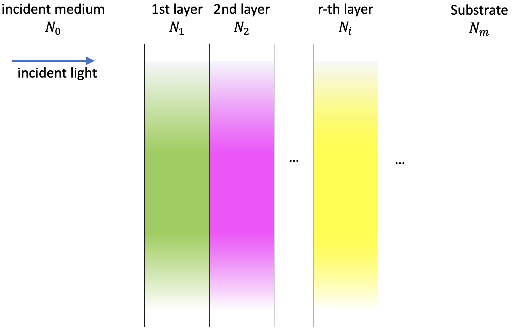
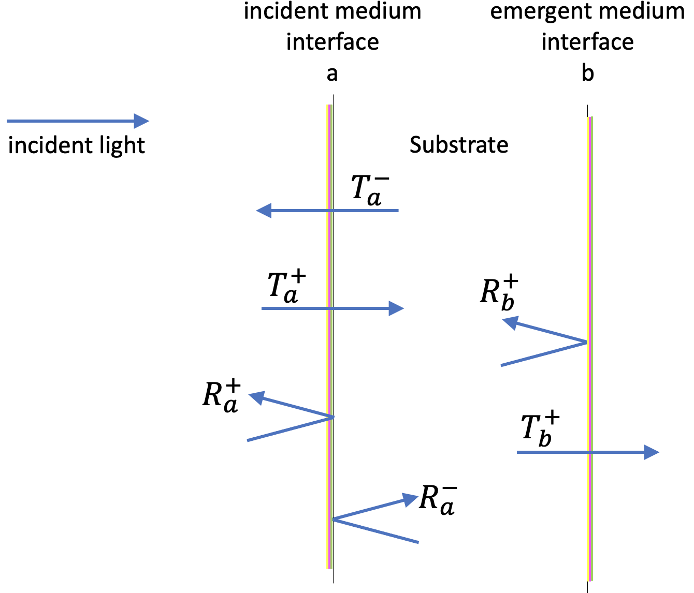
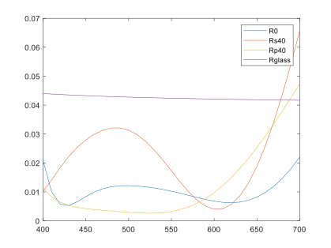
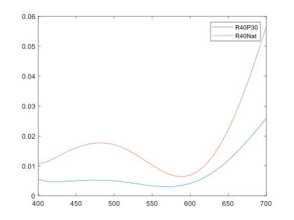
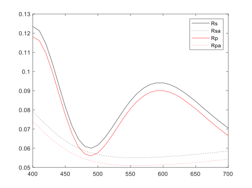
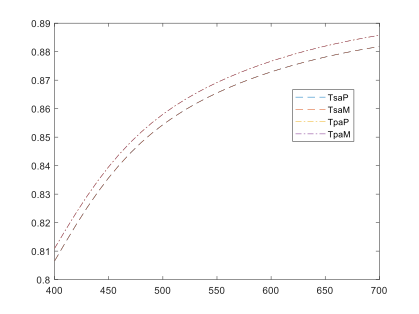
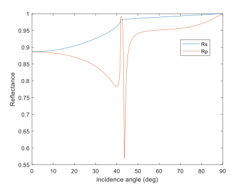
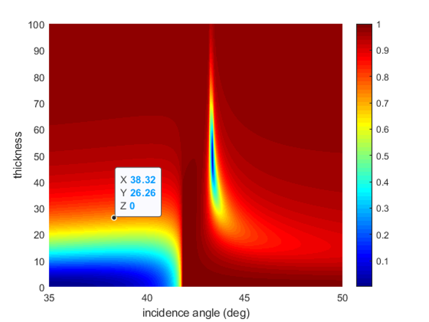
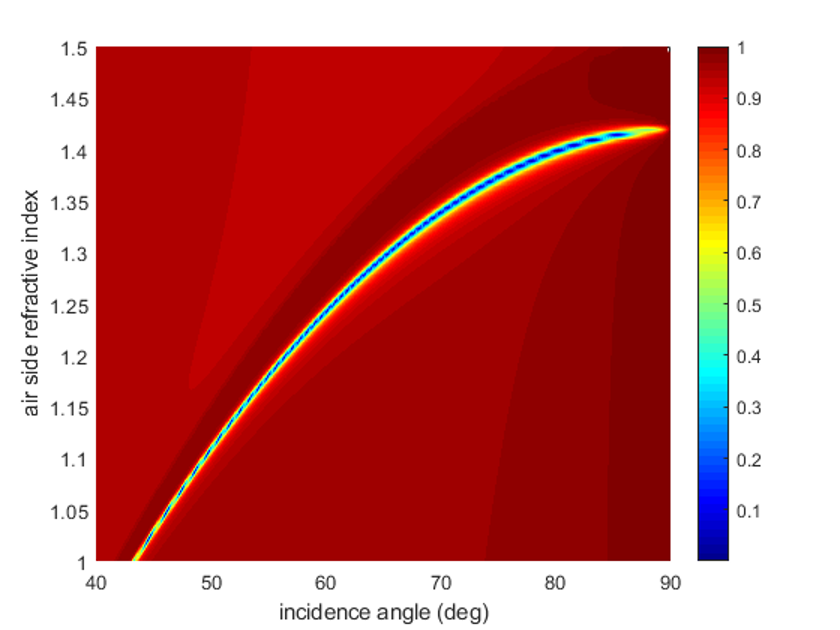

# Thin film optics computations in a high-level programming language environment: tutorial

## I. Introduction

Thin film coatings can be found in a wide variety of devices and are truly ubiquitous in the daily life of billions of people. The technology has become so ingrained in our global society that it is often overlooked. For example, in smartphones thin films have a profound effect on touch panels and help to improve touch features, increase the transmittance of touch panels, and lengthen the lifespan of displays. For liquid crystal displays applications, optical thin film coatings are used in regard to these devices to produce lenses with virtually no reflection, metal films with a high level of reflectance, and optical filters and mirrors that are used to create rich, vibrant colors. Reflecting telescopes utilize optical thin films to produce mirrors that are highly reflective. In solar energy, solar panels performance rely on, for example, high-durability transparent thin film that protect their surface. In transportation, defrosters and transparent heaters that are used to keep the windows of vehicles from freezing during cold weather make also use of thin film technology. (Schmidtke 2010; Eckhardt, Siebold, and Lasagni 2016; Labidi, Tahar, and Choubani 2011; Horng et al. 2019; Theuring et al. 2015; Deng et al. 2018; Ge et al. 2018; Carretero and Alonso 2018; Wang et al. 2018; Guenster, Ristau, and Bosch-Puig 2000; D. Ristau et al. 2002; Detlev Ristau et al. 1999; S. Bosch, Leinfellner, et al. 2000; Chiang 2004)(Santbergen, Smets, and Zeman 2013; Park et al. 2016; Ahmed and Mehaney 2019; Lee et al. 2015; C. Liu et al. 2018; Meng et al. 2017; Zhu et al. 2018; Dai et al. 2016; Ng et al. 2019; Ilic, Went, and Atwater 2018; Garlisi et al. 2020; Laurence et al. 2020; Aly, Ahmed, and Shaban 2020; X. Liu et al. 2014; Shirayama et al. 2016; Dumanli and Savin 2016; Bullock et al. 2018; Yang et al. 2016; Ríos et al. 2016; Ji et al. 2017; Li, Butun, and Aydin 2015; Guo et al. 2014; Alaaeddin et al. 2019; Zhao et al. 2011; Han and Chang 2014; Busch et al. 2007; Myroshnychenko et al. 2008).

The computation of the optical performances (reflectance, transmittance, phase changes upon light reflection, etc...) of thin film layered structures is a topic of major practical interest. The accurate theoretical framework for the problem is the electromagnetic theory of light and a good knowledge of this theory is required for addressing all the related technological issues in depth. The basic underlying assumption is that light interference governs the pass of light through the layers, because of its ‘thin’ character. This normally means physical thicknesses up to some microns (maximum). Conversely, we will always assume that the pass of the light through the substrates is described in terms of beam intensities. All these aspects, for our present development, are established in detail in the references significant in the field (Born and Wolf 1999; Macleod 2010; Kaiser and Pulker 2013; Furman and Tikhonravov 1992; Berning 1963; Yeh 2005; Arwin 2015) and, for clarity and conciseness, we adopt as a reference text for our approach, the optical theory as it is developed in ch. 2 of Macleod’s book (Macleod 2010). This textbook is one of the most renowned in the field from its first edition and has updated its contents continuously. We will assume that the reader has a good/reasonable knowledge of that text, since it is a requirement for our present developments. A deep and detailed understanding is not required, as far as all the definitions and formulas presented therein are clearly understood. Operating this way we ensure a sound theoretical basis for our work by simply including here a short summary of the important theoretical results and, at the same time, using for our program codes notations similar to our reference text. 

The computation of the optical properties of thin film coating finds application in a wealth of fields. Thin film coatings are one of the main components in the efficiency of solar cells and examples can be found of the optimization of such coatings by modeling(Zhao 2011; Santbergen 2013). The transfer matrix method is also applied in the maximization of absorption in the active layers of the solar cells with examples in perovskite solar cells(Shirayama 2016), in the use of specific absorbing layers(Yang2016; Liu2014), or in plasmonic light trapping(Guo 2014). Another range of application where the knowledge provided by simulation is essential is in the design of color filters for photodetectors or light-emitting devices in different wavelength ranges(Li 2015; Dai 2016; Dumanli 2016; Park2016), or displays(Lee 2015; Ji 2017). Thin film coatings and their modeling play an important role in biosensors(Ahmed 2019; Dai 2016; Meng 2017) and photodetectors(Bullock 2018). Other examples where computation of thin film performance is useful is in coatings for glasses in automotive or building industries(Garlisi 2020; Aly 2020), for high power lasers (Laurence 2020),  wearable and implantable optoelectronic devices(Liu 2018), graphene absorbers(Zhu 2018), gravitational wave detectors(Mitrofanov 2015) or relativistic light sails(Ilic 2018).

In the present Tutorial we will address the general case: thin film structures with any number of layers, with transparent or absorbing materials, with oblique incidence angle and incident polarized light beams. Thus, we think that the utility of our present work is wide and quite general. We do not allow anisotropy in the materials; this is not a serious limitation in practice, since this is a very advanced and specific topic of limited practical interest. In short, a thin film structure consists of a series of plano parallel layers alternating different materials (usually transparent) deposited on a substrate. When light incides on the structure, the interference effects originated at the interfaces of the layers give rise to some resulting reflected and transmitted beams. Overall, the properties of the reflected and transmitted beams can be dramatically changed depending on the combination of refractive indices and thicknesses of the layers of the structure. In the most general case, the refractive indices are dispersive (different for each wavelength) and able to represent absorbing materials, by being defined by complex numbers (not simply by real numbers). The incidence angle of the light is also a characteristic parameter for the problem. Thus, the primary objective of a computing program for thin films is to determine the characteristics of the resulting reflected and transmitted beams, from the knowledge of the incident beam and the design parameters of the structure. 

This brief description is useful to explain our practical approach to build a computation program. After a concise theoretical introduction, we begin by the precise optical description of the thin film structure. Next, the electromagnetic theory is used to physically describe the light interference effects at all the interfaces, leading to some convenient key parameters (basically the overall reflectance and transmittance coefficients) to characterize the structure. The core of the theory is built inside some numerical ‘functions’ that the user does not need to change. Finally, once the overall parameters mentioned are calculated, the last part of the program is to use them for finding the relevant measurable magnitudes for the problem under study (say light intensity reflectance, transmittance, etc). We will illustrate all the procedures by developing elementary examples that will enhance the capability of the user to, simply, modify them in an intuitive manner to suit the specific user’s needs.
The Tutorial is organized as follows. Initially we give a short summary of the most important theoretical results, following the developments of Macleod and simultaneously introducing the designation of the magnitudes in our codes. Next, a first basic example is presented to illustrate the simplicity of the overall procedure. In a second example (more advanced) we will show all the relevant programing details. The 3rd example illustrates how our computational procedures are able to address specialized research topics by simple adaptations of our codes. Finally, a schematic review of the overall programming techniques will summarize them. The final complete details related to how to calculate other interesting quantities, explanations about some functions and how to enhance the capabilities of the present software are developed in the Appendix. 

For conciseness, the examples are presented in Matlab language, where a ‘function’ is some limited code that works as follows: you give the function some input as arguments and the function gives some output. A ‘script’ in Matlab is a general piece of code that handles the operations and calls the functions. It is also possible to include the functions inside the code of a script in a single file (we will do it in one case in the Appendix). The Python version of the programs is also included in the Appendix.

## II. Summary of Theoretical Results

### A. Description of the thin film structure

Thin films are structures composed by plano-parallel layers made of materials that have different optical properties. Due to the interference effects generated by the assembly, dramatic changes in the optical performance of the setup can be achieved. The precise theoretical framework to approach the problem is the electromagnetic theory of light(Born and Wolf 1999; Macleod 2010; Kaiser and Pulker 2013; Furman and Tikhonravov 1992; Berning 1963; Yeh 2005; Arwin 2015) and, apart from manufacture difficulties, a deep knowledge of this theory allows addressing all the design issues adequately. 

In our present development, we adopt as a reference text for our approach, the optical theory as it is developed and presented in chapter 2 of Macleod’s book(Macleod 2010). We will summarize now the main results presented therein at the same time we introduce the names of the different magnitudes in our programs in accordance with the text. All our procedures will be valid for dispersive materials but the description here is monochromatic for simplicity. 

Each material constituting any layer is isotropic and it has a definite refractive index. For transparent materials this value is simply the ratio between the speed of light in vacuum and in the medium (a real number) but, when the material is absorbing, the refractive index is a complex number with not so simple interpretation(Cabrera, López, and Agulló-López 1998; Born and Wolf 1999). We will number the series of materials increasing from the ambient ($0$) to the substrate $(1, 2, …, m)$, writing their complex refractive indices as  $N_0, N_1, ..., N_m$. In accordance, the physical thicknesses are both ‘infinite’ for the ambient and substrate ($d_0=d_m=\infty$) and $d_1,d_2,...,d_{m-1}$ for the layers (having units of length). We will always realistically assume the ‘ambient’ where we perform the experiments to be transparent ($N_0\in\mathbb{R}$) but we allow the rest of the materials to be absorbing, writing for material of layer ‘$r$’ in the form $N_r=n_r-ik_r$ , where ‘$i$’ is the imaginary unit.
The substrate may be coated also at the rear surface. If its shape is plano-parallel and its constitutive material is non-absorbing, we will be able to calculate transmittances and reflectances also for this case. 


Figure 1. Layout of the physical configuration we consider here.


The substrate may be coated also at the rear surface. If its shape is plano-parallel and its constitutive material is non-absorbing, we will be able to calculate transmittances and reflectances also for this case. 

We assume that there is only one normal direction to all the interfaces. If this normal coincides with the incident light beam direction, we have the normal incidence case. If not, the oblique beam direction and the normal direction define the incidence plane in our problem, being the incidence angle named $\theta_0$. Following our reference text, from now on, in our developments we will consider only the components of the electric and magnetic fields that are parallel to the interfaces(Macleod 2010). Besides, it is important to note that the electromagnetic theory of light demonstrates the validity of the Snell law for complex refractive indices, for the rays trough the layers(Macleod 2010), allowing us to write:
$$N_0\sin\theta_0=N_1\sin\theta_1=...=N_m\sin\theta_m . \qquad (1)$$
To develop the theory for the general case of oblique incidence with isotropic materials, the transverse electric field of the incident beam must be separated into its parallel (‘p’, also known as ‘TM’) and the perpendicular (‘s’, also known as ‘TE’) components. This separation is crucial in all the theory below, since the two components do not mix or interfere and, simply, lead to two independent problems to be solved: the ‘p’ and the ‘s’ problems. Moreover, the ‘s’ components of all the fields are mutually parallel and inherently tangential to all the interfaces unlike the ‘p’ components, that change direction at each light refraction. To simplify things, as we have mentioned above, in thin film developments it is usual to consider only the tangential parts of the ‘p’ electric fields, since they are the only responsible for energy fluxes in the direction normal to the layers. Thus, in what follows, two independent problems have to be solved separately: the ‘p’ problem (for its tangential part of the electric field) and the ‘s’ problem, for this component of the electric field. The solving techniques are quite similar, but not identical.

### B. Numerical Statement of the Problem

For each of the materials in our structure, assuming incidence angle $\theta_0$, let us introduce the tilted optical admittance for the ‘p’ and ‘s’ polarizations according to the formulas:
$$\eta_p = \frac{N}{\cos\theta}, \eta_s=N\cos\theta, \qquad (2)$$
where expression (1) has to be used for computing $\theta$ inside the materials. For each polarization, the numerical solving procedures use a $2\times 2$ matrix for each layer. If the geometrical thickness of the layer is $d$, the corresponding matrix is:

$$M = \begin{pmatrix}
\cos \delta & (i\sin\delta)/\eta \\
i\eta\sin\delta & \cos\delta 
\end{pmatrix}
\; \mathrm{with} \; \delta = \frac{2\pi Nd\cos\delta}{\lambda}. \qquad (3)$$

For the assembly, with our notation, we finally have:
$$
\begin{pmatrix}
B \\
C 
\end{pmatrix} = M_1M_2...M_{m-1}\begin{pmatrix}
1 \\
\eta_m 
\end{pmatrix}, \qquad (4)
$$

from where we compute

$$r=\frac{\eta_0B-C}{\eta_0B+C}, \; T=\frac{4\eta_0 Re(\eta_m)}{\left|\eta_0B+C\right|^2}. \qquad (5)$$

Since there are the two independent ‘p’ and ‘s’ polarizations, with independent optical admittances as given by (2), we finally may define the four quantities 
$$r_P,T_p,r_s,T_s . \qquad (6)$$

The ‘r’ quantities are complex ratios for the electric field (between reflected and incident amplitudes). Then, the intensity reflectances are, simply:
$$R_p=\left|r_p\right|^2, R_s=\left|r_s\right|^2$$
and the phase changes upon reflection are usually defined by the single complex quantity $\rho$ or, equivalently, by the two real quantities $(\Delta,\Psi)$ according to the following equations(Azzam, Bashara, and Ballard 1978):
$$\rho\equiv\frac{r_p}{r_s}\equiv\tan\Psi\cdot e^{i\Delta}$$

For the ratios between transmitted and incident beam intensities, the relevant quantities are, directly $T_p$ and $T_s$. Note that usually it is very difficult to measure phase changes at the exit side of the substrate and only light intensity ratios are of practical interest for transmitted light.
When the substrate is transparent and coated at both sides (designed here ‘a’ and ‘b’) the relevant formulas for the overall intensity ratios are the following, according to the notations introduced in our Figure 2.

 Figure 2: Notations used in the text for two-sided coated samples.

$$T=\frac{T_aT_b}{1-R_a^-R_b^+}, R = \frac{R_a^++R_b^+\left(T_a^2-R_a^-R_b^+\right)}{1-R_a^-R_b^+}.\qquad (9)$$


Note that when the substrate is not semi-infinite (i.e., when there is back side light reflection mixed with the front side reflected beam) it does not make sense to measure phase changes at reflection and only light intensity ratios are of practical interest.

Finally, considering both light polarizations ‘p’ and ‘s’, all the relevant quantities for all the measurable quantities at front and rear surfaces are:
$$
\begin{matrix}
R_p^{a+} = \left|r_p^{a+}\right|^2, R_p^{a-} = \left|r_p^{a-}\right|^2, T_p^{a+}, T_p^{a-}, R_p^{b+}=\left|r_p^{b+}\right|^2,T_p^{b+},\\ 
R_s^{a+} = \left|r_s^{a+}\right|^2, R_s^{a-} = \left|r_s^{a-}\right|^2, T_s^{a+}, T_s^{a-}, R_s^{b+}=\left|r_s^{b+}\right|^2,T_s^{b+}\end{matrix} \qquad (10)
$$
In the code that follows, we propose the following names for these quantities: ```Rp_aPlus```, ```Rp_aMinus```, ```Tp_aPlus```, ```Tp_aMinus```, ```Rp_bPlus```, ```Tp_bPlus```, ```Rs_aPlus```, ```Rs_aMinus```, ```Ts_aPlus```, ```Ts_aMinus```, ```Rs_bPlus```, and ```Ts_bPlus```. Accordingly, for the whole sample, the reflectances and transmittances will be designed: ```Rp```, ```Rs```, ```Tp```, and ```Ts```.

For a dispersive range of wavelengths, all the above processes have to be repeated at each single wavelength, according to the way the dispersion is defined. At this point, different practical situations may arise. The simplest case corresponds to having the changes of refractive index with wavelength for one material defined by means of a ‘dispersion formula’ or ‘dispersive model’: given the wavelength, we use a formula to calculate the index. Of course, the practical validity of the procedure relies on the previous practical knowledge of the material. For example, for dielectric materials in the visible range between 400 and 700 nm (maybe having weak light absorption), a common formula is the Cauchy dispersion(S. Bosch, Ferré-Borrull, and Sancho-Parramon 2001; Sancho-Parramon et al. 2003), given by:
$$n(\lambda) = n_0+\frac{n_1}{\lambda^2}+\frac{n_2}{\lambda^4}, k(\lambda) = k_0\exp\left(\frac{k_1}{\lambda}\right), \lambda \;(\mathrm{nm})\qquad (11)$$

(note that $n_0$, $n_1$, $n_2$, $k_0$ and $k_1$ are numerical constants for defining the complex refractive index $N=n-ik$ of the single material which constitutes a single layer, and the notation is not related to layers 0, 1, 2,…). Another common situation arises in case of using one material whose refractive index is known in advance and the corresponding data have been previously stored in a file in form of a list, for each wavelength of our range of interest. We will address these (and other) ways of defining the dispersive refractive index in the following paragraphs.

Finally, there is an important detail to be considered for oblique incidence with dispersive materials regarding the validity of the Snell law in refraction (expression (1)). When we calculate backside quantities, the actual incidence angle on the substrate changes with the wavelength. This fact will be considered explicitly when developing Example 2.

### C. Calculation of the Magnitudes of Interest

Finally, once the coefficients defined in (10) are found for the sample, the measurable magnitudes for the problem (usually beam intensity reflectance, transmittance, etc) may be computed. It is important to note that, for finding the different magnitudes of interest, it is necessary to master the physical concepts involved in the problem (it is not only a numerical issue). For example, assume the incident light beam is linearly polarized, with the electric field vibrating at angle $\phi$ with respect to the incident plane. Then, the ratio between ‘p’ and ‘s’ electric field incident amplitudes is $\frac{E_p^0}{E_s^0}=\frac{\cos\phi}{\sin\phi}$. Thus, the reflected and transmitted amplitudes have to be multiplied according to this ratio and the reflected and transmitted energies will be the following weighted means
$$T = T_p\cos^2\phi+T_s\sin^2\phi,\;R=R_p\cos^2\phi+R_s\sin^2\phi\qquad (12)$$
of course affecting all the above quantities:
$$
\begin{matrix}
R_p^{a+}\cos^2\phi, R_p^{a-}\cos^2\phi, T_p^{a+}\cos^2\phi, T_p^{a-}\cos^2\phi, R_p^{b+}\cos^2\phi, T_p^{b+}\cos^2\phi,\\ 
R_s^{a+}\sin^2\phi, R_s^{a-}\sin^2\phi, T_s^{a+}\sin^2\phi, T_s^{a-}\sin^2\phi, R_s^{b+}\sin^2\phi, T_s^{b+}\sin^2\phi
\end{matrix} \qquad (13)
$$

Similarly, for incident elliptically polarized light defined by the parameters $(\psi,\chi)$, it will be necessary to relate them to the ‘p’ and ‘s’ electric field components and subsequently to the reflected or transmitted calculated magnitudes(Saleh and Teich 2013; Arwin 2015). Thus, in the most general case, finding the different magnitudes of interest requires solving a detailed physical problem. The numerical procedures we are explaining in this Tutorial (examples and Appendix) address some common situations but it is not at all possible to be comprehensive for all the practical configurations and measurable magnitudes.

## III.	Example 1 (BASIC): Showing the Performances of an anti-Reflective Ccoating on Glass

### A. Definition of the Physical Structure

#### 1. Range of wavelengths

The starting point of the whole process is to define the range of wavelengths of interest and its units. Subsequently, in all our programs all the calculations will be performed step by step for each single wavelength. The range of wavelengths is fixed by a variable ‘```x```’ (here supposed to be in nanometer units), as follows:

```
nlamb=31; x=linspace(400,700,nlamb);
```

The meaning of this line of code is obvious: we take 31 wavelengths equally spaced from 400 to 700 nanometers (both limits included), so in 10 nm steps. It is important to note that the choice of the range and the units is crucial, since this range is implicitly understood to be unique and the same for all the forthcoming procedures. Nevertheless, it should be clear from now that the adaptation of the programs to other units or even to non-equally spaced intervals is straightforward.

#### 2. Thickness and dispersion of one layer

Next, we have to define each individual layer of the physical configuration: geometrical thickness and material. We have to decide the units for the thickness. Here we will use ‘nm’ consistently (microns could be another equivalent choice). To identify each medium (or material) in the lines of code of our program we will use two items: 

i) one keyword acting as the name identifying the material (in practical terms, the type of dispersion of its refractive index), and 

ii) the numerical parameters of the dispersion type that actually give the refractive index values in the range of interest. For example, for a 120 nm thick layer of material, whose refractive index obeys the Cauchy formula (11) with five parameters $n_0$,$n_1$,$n_2$,$k_0$,$k_1$ with $n_0=2.0$, $n_1 = 10000.0\;\mathrm{nm^1}$, $n_2 = 0.0$, $k_0=0.01$, $k_1=200.0\;\mathrm{nm}$.

we will use a line of code like the following:

```
120. 'Cauchy' {2.0 10000. 0. 0.01 200.};
```

Later in our program, the refractive index of the material for each wavelength will be computed using the five parameters supplied, according to the dispersion formula (11). Namely: 

```
  v5p(1)=2.0; v5p(2)=10000.; v5p(3)=0.; v5p(4)=0.01; v5p(5)=200.;
  nnn=v5p(1)+v5p(2)./x.^2+v5p(3)./x.^4;
  kap=abs(v5p(4))*exp(v5p(5)./x);
  Nlay=nnn-1i*kap;
```

Regarding the details of the Matlab language, note the use of the ```{ }``` braces and blank spacing between values after the text '```Cauchy```' and the use of the operators ‘```./```’ and ‘```.^2```’ for the division and squaring operations, in order operate for the full length of ‘```x```’. If Python language is used, these conventions are different.

To designate the material for the ambient, a meaningful line of code can be:

```
Inf 'Constant' {1.000277 0.} , 
```

with ‘```Inf```’ meaning infinite thickness and ```‘Constant’``` as the appropriate name for designating any material whose refractive index is constant. Here in this line, the ambient could be ```‘air’``` with ```nnn=1.000277``` and ```kap=0.0```. Later the two parameters supplied will be used in the code:

```
  v2p(1)=1.000277; v2p(2)=0.;      % kap must be ‘0’ for ambient!!
  nnn=v2p(1); kap=abs(v2p(2));      
  Nlay=(nnn-1i*kap).*linspace(1,1,length(x));
```

This procedure is useful for defining any material without dispersion since it uses two parameters (real and imaginary part of the ```‘Constant’``` refractive index) creating an array of constant complex refractive indices, one for each item in ‘```x```’. These indices, in fact, repeat the values supplied ‘```v2p(1)=1.000277```’ and ‘```v2p(2)=0.```’, but have the right format we use later in our programs. Note that we are forcing the imaginary part of the calculated complex refractive index to be negative, as required in our theoretical developments. 

Typically we simply use for ambient ```‘air’``` the following line:

```
Inf 'Constant'  {1. 0.}. 
```

Note that for ambient ```‘water’``` we could similarly do:

```
Inf 'Constant'  {1.33 0.}.
```

For glass, typically the refractive index is known with high precision from the manufacturer. Then, if the coating is deposited on a glass substrate, the definition of the material as our semi-infinite substrate can be:

```
Inf 'BK7' {0} , 
```

with the parameter ‘0’ alone meaning that no parameters are required, since we will use the manufacturer’s data (“SCHOTT N-BK7® | SCHOTT Advanced Optics” n.d.) for finding the refractive index for the wavelengths (‘```x```’) as follows:

```
    n2=1+(1.03961*x.^2)./(x.^2-6.0e3)+(0.23179*x.^2)./ ...
    (x.^2-2.0e4)+(1.0146*x.^2)./(x.^2-1.0e8);
    nnn=sqrt(n2);
    Nlay=nnn-1i*0.0;
```

This code works according to the formula supplied:
$$
n^2(\lambda) = 1+\frac{1.03961\lambda^2}{\left(\lambda^2-6\cdot10^3\right)}+\frac{0.23179\lambda^2}{\left(\lambda^2-2\cdot10^4\right)}+\frac{1.01460\lambda^2}{\left(\lambda^2-1\cdot10^8\right)},\;k(\lambda)=0.0,\lambda\;\mathrm{in\; nm}.
$$
Again, we get an array of complex refractive indices, one for each item in ‘```x```’, that have null imaginary part.

So far, we have presented three ways for introducing the refractive index data of the materials in our programs: the use of a dispersion formula, supplying the fixed constant values or computing the values from manufacturer’s data. In Example 2 we will allow more options.

#### 3. The layers of the coating

Next we have to define our physical configuration. We plan to study the performances of an anti-reflective (AR) coating on glass. We know from references(Macleod 2010) that three alternating layers of low, high and low refractive indices with suitable thicknesses will do the job. For example, assume we use $\rm MgF_2$ as low index material with dispersion given by:
$$
n(\lambda) = 1.36+\frac{4100}{\lambda^2},\;k(\lambda)=0.0,\lambda\;\mathrm{in\; nm}.
$$

and $\rm TiO_2$ as high index material, with dispersion:
$$
n(\lambda) = 2.00+\frac{17500}{\lambda^2}+\frac{9800}{\lambda^4},\;k(\lambda)=0.0,\lambda\;\mathrm{in\; nm}.
$$

The complete AR configuration is described by a ‘struct’ data type in Matlab, that we give the name ‘layers’, and consists of five lines:
```
layers = {Inf 'Constant'    {1. 0.};
          93 'Cauchy' {1.36 4100. 0. 0. 0.};
          121 'Cauchy' {2.0 17500. 98000. 0. 0.};
          185 'Cauchy' {1.36 4100. 0. 0. 0.};
          Inf 'BK7' {0} };
```

The first layer is in fact the ambient, with thickness ‘```Inf```’, material ```‘Constant’``` and the 2 parameters for defining the actual refractive index given by the bracket ```{1. 0.}```.The second layer (the most external one) is a ```93``` nm thick MgF2 layer, whose dispersion is ```‘Cauchy’``` type with the five associated parameters  ```{1.36 4100. 0. 0. 0.}```. The third (central) layer is a ```121``` nm thick sheet of TiO2 material again with dispersion type ```‘Cauchy’```, but now with the five associated parameters  ```{2.0 17500. 98000. 0. 0.}```. The fourth (innermost towards the substrate) layer is like the most external one, but with thickness ```185``` nm. The 5th layer is, in fact, the semi infinite substrate of ```BK7``` glass material.

### B. Performing the calculations

We will assume always the ambient to be transparent(Macleod 2010) but, to simplify computations, we use one incidence angle and one ambient refractive index value for each single wavelength in the array ```x```. Thus, both the index of the transparent ambient (```N0```) and the incidence angle in radians (```incang```) must be arrays of length ```nlamb```.

For one layer of thickness ```d``` whose dispersive refractive indices are ```N```, the $2\times2$ matrices mentioned in our expression (3) and corresponding to each wavelength in ```x```, are named ```Ms``` for ‘s’ and ```Mp``` for ‘p’ polarizations. The matrix product (for each wavelength in ```x```) for the whole structure ```layers``` is performed and the overall ```rs``` and ```rp``` (and also ```Ts``` and ```Tp```) coefficients of the assembly are obtained by means of the following function:

```
function [rs,rp,Ts,Tp] = calc_rsrpTsTp(incang,layers,x)
```

Most of the measurable quantities such as reflectance, transmittance, polarization changes... are directly computed from the knowledge of these overall ```[rs,rp,Ts,Tp]``` coefficients. The source code and description of these two functions are presented in the Appendix, since they correspond to the core of the calculations and need not to be modified by the user.

### C. Plotting the Spectral Reflectances

This Example 1 illustrates the calculations of light reflectances for one stack of three layers on a semi-infinite substrate. Semi-infinite is the term for a substrate where there is no beam coming back from the rear of the substrate. As demonstrated in chapter 2 of Ref(Macleod 2010), the intensity reflectances Rs or Rp can be computed by simply squaring the values ```rs``` and ```rp``` previously found. 

First we will calculate the reflectance at normal incidence, i.e., for

```
incang=0. * linspace(1,1,length(x))
```

where ‘p’ and ‘s’ polarizations are equivalent(Macleod 2010). For comparison, we will show the ```Rp``` and ```Rs``` reflectances at 40 deg, i.e., by making:

```
incang=40.*pi/180 * linspace(1,1,length(x)
```

Moreover, the reflectance of the bare substrate at normal incidence is also calculated by redefining the configuration (i.e., eliminating the coating). 

Figure 3 illustrates how the reflectance of the bare substrate at normal incidence (```Rglass```), that is more than 4% for all the full range from 400 to 700 nm, is reduced to a mean value of around 1% for that range (line R0). For comparison, for the incidence angle of 40 deg, the two quite different reflectances ```Rs40``` and ```Rp40``` are also shown.


Figure 3. Reflectances of a semi infinite glass substrate coated with our three thin layers. Reflectance of the sample (coated glass) ```R0``` and of the bare substrate ```Rglass``` at normal incidence. For 40 deg. incidence angle, reflectances of the sample for incident ‘s’ polarisation ```Rs40``` and for incident ‘p’ polarization ```Rp40```.

Next in this Example 1, for the 40 deg. incidence angle, we compare the light reflection for the two following cases: incident linearly polarized light (vibrating at 30 deg. with respect to the incidence plane) and incident natural (non-polarized) light. Figure 4 shows these results, designated respectively as ```R40P30``` and ```R40Nat```. They have been computed using our expression (10).


Figure 4. For 40 deg. incidence angle, reflectances of the sample for incident linearly polarized light (vibrating at 30 deg with respect to the incidence plane) ```R40P30``` and for incident non polarized (natural) light ```R40Nat```.

```
% script Example 1

nlamb=31; x=linspace(400,700,nlamb);   	% defining the wavelength range
layers = {Inf 'Constant' {1. 0.};		% defining the configuration
           93 'Cauchy' {1.36 4100. 0. 0. 0.};
          121 'Cauchy' {1.98 17500. 98000. 0. 0.};
          185 'Cauchy' {1.36 4100. 0. 0. 0.};
          Inf 'BK7' {0} };
 
incang=0.*pi/180 * linspace(1,1,length(x));	% defining the incidence angle
[rs,rp,Ts,Tp]=calc_rsrpTsTp(incang,layers,x); % calculating the coefficients
R0=(abs(rs)).^2; 					% rp=rs at 0 deg
 
incang=40.*pi/180 * linspace(1,1,length(x));	% … the wew incidence angle
[rs,rp,Ts,Tp]=calc_rsrpTsTp(incang,layers,x); % the new coefficients
Rs40=(abs(rs)).^2; 					% Rs at 40 deg
Rp40=(abs(rp)).^2;					% Rp at 40 deg
 
NO_layers = {Inf 'Constant' {1. 0.};		% defining the bare substrate
          	Inf 'BK7' {0} };
incang=0.*pi/180 * linspace(1,1,length(x));	% incidence angle 0 deg
[rs,rp,Ts,Tp]=calc_rsrpTsTp(incang,NO_layers,x);
Rglass=(abs(rs)).^2; 				% R of bare substrate at 0 deg
 
plot(x,R0,x,Rs40,x,Rp40,x,Rglass), legend('R0','Rs40','Rp40','Rglass')

ang_fi=30.0*pi/180;        % vibration direction for linearly polarized light 
R40P30=(Rs40*(sin(ang_fi))^2+Rp40*(cos(ang_fi))^2)/2; % reflected intensity
R40Nat=(Rs40+Rp40)/2;   % reflected intensity for natural light
 
figure, plot(x,R40P30,x,R40Nat), legend('R40P30','R40Nat') 

% end of script Example 1
```

## IV. Example 2 (ADVANCED): Computations for a Susbtrate Coated at both Sides

### A. Definition of the Physical Structure

#### 1. Other Ways to Specify the Dispersion of one Layer

In Example 1, three ways for defining the refractive index of materials were introduced. Often the refractive index data for one material are taken from databases or from files storing the values found in previous experiments(Johnson and Christy 1972). For our computations, it is only required to have available the values for our wavelength variable ```x```. Thus, when refractive index data are stored in a file, it is convenient to allow defining one single layer with a line of code like:

```
135   'File'   {'Ag_n_k.dat'}; 
```

representing a 135 nm thick layer of a material whose refractive index is contained in a ```‘File’``` whose name is ```‘Ag_n_k.dat’```, the only requirement being that the data in the file have to cover the range of wavelengths ```x``` of our problem. Then, after reading the values, these are linearly  interpolated to the exact values ```x```. In case of mixtures of materials in one single layer, the Effective Medium Approximation (EMA) (Aspnes and Theeten 1979) may be suitable for representing its refractive index. The code performing these calculations and creating the file (equivalent in format to the previous ```'Ag_n_k.dat'```) is more difficult to be developed, but is also presented in the Appendix as a script that applies the EMA theory for mixtures up to three materials(S. Bosch, Ferré-Borrull, et al. 2000).

#### 2. How the dispersion of the layers is handled in the program

In the explanations of Example 1 we did not describe how the types of dispersion are handled inside the program. We do it by means of a ‘function’ as follows. According to the way we have build our structure ```layers```, its line number 1 identifies the ambient, line number 2 designates the most external layer, line 3 the next internal ... increasing towards the substrate. Thus, for ```num_lay```=1, 2, … the code

```
layers{num_lay,2}
```

corresponds to the keyword (like ```‘Constant’``` or ```‘Cauchy’``` or ```‘BK7’```) that identifies the kind of material for the layer with number ```num_lay```. Thus, once the structure ```layers``` and the array of wavelengths ```x``` are given, the set of refractive index values ```Nlay``` corresponding to the layer with number ```num_lay``` is obtained by calling the following function:

```
function Nlay = calc_Nlayer(layers,x,num_lay)
    switch layers{num_lay,2}
        case 'Constant'
            v2p=[layers{num_lay,3}{1},layers{num_lay,3}{2}];
            nnn=v2p(1); kap=abs(v2p(2));
            Nlay=(nnn-1i*kap).*linspace(1,1,length(x));
        case 'Cauchy'
     	v5p=[layers{num_lay,3}{1},layers{num_lay,3}{2},layers{num_lay,3}{3},..
                layers{num_lay,3}{4},layers{num_lay,3}{5}];
      nnn=v5p(1)+v5p(2)./x.^2+v5p(3)./x.^4; kap=abs(v5p(4))*exp(v5p(5)./x);
            Nlay=nnn-1i*kap;
        case 'Sellmeier'
            v2p=[layers{num_lay,3}{1},layers{num_lay,3}{2}];
            nnn=sqrt(1+v2p(1).*x.^2./(x.^2-v2p(2))); kap=0;
            Nlay=nnn-1i*kap;
        case 'File'       
            aux=load(layers{num_lay,3}{1});  % N,k data           
            nnn=interp1(aux(:,1),aux(:,2),x); 
            kap=interp1(aux(:,1),aux(:,3),x); 
            Nlay=nnn-1i*abs(kap);     
            Nlay=reshape(Nlay,[1,length(x)]);
        case 'BK7'
            n2=1+(1.03961*x.^2)./(x.^2-6.0e3)+(0.23179*x.^2)./ ...
                (x.^2-2.0e4)+(1.0146*x.^2)./(x.^2-1.0e8);
            nnn=sqrt(n2);
            Nlay=nnn-1i*0.0;
    end
end
```

Clearly, adding new types of media (```materials```) for all our programs amounts only to add new ```case``` caluses inside this function. Each case must be identified by a keyword (like ```‘Constant’``` or ```'BK7’``` or ```‘File’```…) and has to be connected (inside this function) to the corresponding dispersive formula or file.

#### 3. The coatings of the two sides

For Example 2, assume the substrate is a plano parallel slab of transparent glass, coated with thin films at both sides. The transparency of the substrate is an absolute requirement for the validity of the following two-sided calculations. Certainly, any substrate with a thickness of the order of millimeters will absorb all the light unless the imaginary part ```kappa``` of its refractive index  value (written $k$ in our formulas above and ```kap``` in the previous function) is absolutely negligible. Thus, the results computed in our programs are not valid unless the requirement of transparency of the substrate is fulfilled. 

For simplicity, we continue working with the same range of wavelengths: 

```
nlamb=31; x=linspace(400,700,nlamb);   
```

If the substrate is transparent, its thickness is not relevant and it can be characterized in our programs as one layer of ‘Inf’ thickness: 

```
Inf 'BK7' {0};
```

Assume that the substrate is coated at the first side, and the first side structure is (from ambient to substrate):

```
layers_a = {Inf 'Constant' {1. 0.};
          200 'Sellmeier' {1.7 10000.};
           30 'Cauchy'    {1.5 10000. 0. 0.1 150.};
          Inf 'BK7'       {0}};
```

We will suppose that the second side is also coated, with a structure (from substrate to ambient):

```
layers_b = {Inf 'BK7'   {0};      
          300 'Cauchy'  {1.8 10000. 0. 0. 0.};
          30  'File'    {‘EMA3_n_k.dat’};
          Inf 'Constant' {1. 0.}};
```

Note that, for the problem to be meaningful, the last layer at the incident side must be exactly like the first layer of the second side. 

### B. Performing the Core Calculations

#### 1. Front side ('a') forward calculations

Assuming an incidence angle of 10 degrees, the following code calculates the ‘Plus’ quantities at the ‘a’ side, using expression (10): 

```
incang=10*pi/180*linspace(1,1,length(x)); 
[rs,rp,Ts,Tp]=calc_rsrpTsTp(incang,layers_a,x);
Rs_aPlus=(abs(rs)).^2;
Rp_aPlus=(abs(rp)).^2;
Ts_aPlus=Ts;
Tp_aPlus=Tp;
```

#### 2. Front side ('a') backward calculations

To calculate the ‘Minus’ quantities at the ‘a’ side at oblique incidence is a subtle matter. First, reversing the layers is required, by defining a new configuration:

```
layers_ainv=layers_a(end:-1:1,:); 	% inverts layers
```

where the use of the ```:``` operator does the reversing inside the parenthesis ```(end:-1:1,:)```.

A deep understanding of the electromagnetic theory explained in chapter 2 of Ref (Macleod 2010) would be required for fully demonstrating the following procedure. In practical terms, it is only necessary to note that the dispersive nature of the materials implies that the angle entering the substrate changes with the wavelength, according to Snell law (1). Thus, we need to calculate the incidence angle in the way back (```incang_inv```), from the knowledge of the forward incidence angle (```incang```). The refractive indices of the ‘ambient’ medium in the ‘forward’ and ‘backward’ trajectories, respectively, are: 

```
N0=calc_Nlayer(layers_a,x,1);
N0_inv=calc_Nlayer(layers_ainv,x,1);
```

If Snell law (1) is applied to the first and last angles at the coating of the ‘a’ side, one has:

$$
N_0\sin\theta_0=N_m\sin\theta_m
$$

where the quantities $N_0$, $\theta_0$, $N_m$, $\theta_m$ correspond in our code, respectively, to the variables ```N0```, ```incang```, ```N0_inv``` and ```incang_inv```. Thus the code for computing the right value for ```incang_inv``` is:

```
incang_inv=asin(N0.*sin(incang)./N0_inv);
```

Now we are ready for the backwards (corresponding to the ```Minus```) calculations at the ‘a’ side:

```
Rs_aMinus=(abs(rs)).^2;
Rp_aMinus=(abs(rp)).^2;
Ts_aMinus=Ts;
Tp_aMinus=Tp;
```

#### 3. Back side (b) calculations

Fortunately for the ‘b’ side we only need the forward calculations. Since the substrate is plano-parallel, the incidence angles for the wavelengths ```x``` at side ‘b’ in the forward direction are the same as the exit angles at side ‘a’ in forward direction. These are exactly the same angles we have just calculated: ```incang_inv```. Thus, for the forward direction at side ‘b’, where the coating is defined by the structure ```layers_b``` the required code is:

```
[rs,rp,Ts,Tp]=calc_rsrpTsTp(incang_inv,layers_b,x);
Rs_bPlus=(abs(rs)).^2;
Rp_bPlus=(abs(rp)).^2;
Ts_bPlus=Ts;
Tp_bPlus=Tp;
```

### C. Combining and Plotting the Results

#### 1. Computing the overall R and T

All the required quantities are available now for computing the measurable magnitudes R or T for the substrate coated at both sides. Anyway, it has to be noted that the ‘s’ and ‘p’ modes are still independent and separate calculations have to be performed, according to expressions (10).

```
Rs=(Rs_aPlus+Rs_bPlus.*(Ts_aPlus.^2-Rs_aMinus.*Rs_bPlus)) ...
./ (1-Rs_aMinus.*Rs_bPlus);
Rp=(Rp_aPlus+Rp_bPlus.*(Tp_aPlus.^2-Rp_aMinus.*Rp_bPlus)) ...
./ (1-Rp_aMinus.*Rp_bPlus);
Ts=(Ts_aPlus.*Ts_bPlus) ./ (1-Rs_aMinus.*Rs_bPlus);
Tp=(Tp_aPlus.*Tp_bPlus) ./ (1-Rp_aMinus.*Rp_bPlus);
```

#### 2. Some interesting comparisons

One can now compare the results. It is interesting for example to illustrate the difference between the reflectance of the sample (coated at both sides) with the reflectance due to the first side alone. Note that this last quantity can be easily measured by grinding the back side of the substrate (in fact destroying the glass smoothness and the coating at the back side), to avoid the light reflection from this side. Note that the differences between ‘s’ and ‘p’ polarizations in Figure 5 are indeed small, as expected due to the small value of the angle of incidence (10 deg). Conversely, the same Figure illustrates the big differences between the reflectances due to the ‘a’ side alone (```Rsa``` and ```Rpa```) and the reflectances due to the effect of the ‘a’ and ‘b’ sides together (```Rs``` and ```Rp```).


Figure 5. For 10 deg. incidence angle, reflectances due to the two sides of the coated substrate: ```Rs``` for incident ‘s’ polarized light, ```Rp``` for ‘p’ polarized light. For 10 deg. incidence angle, reflectances due to the ‘a’ side alone of the coated substrate: ```Rsa``` for incident ‘s’ polarized light, ```Rpa``` for ‘p’ polarized light.


It is also interesting to check the validity of a completely general result demonstrated in the electromagnetic theory of thin films(Macleod 2010): any ```Plus``` transmittance coincides with the corresponding ```Minus``` one. The two comparisons are plotted independently in Figure 6, by using with the following code:

```
figure, plot(x,Rs,'k',x,Rs_aPlus,'k:',x,Rp,'r',x,Rp_aPlus,'r:')
                legend('Rs','Rsa','Rp','Rpa')
figure, plot(x,Ts_aPlus,'--',x,Ts_aMinus,'--',x,Tp_aPlus,'-.'...
,x,Tp_aMinus,'-.'),  legend('TsaP','TsaM','TpaP','TpaM')
```

Figure 6 illustrates that, even when our coating include absorbing layers (like the innermost one at side ‘a’), our ```Plus``` transmittances coincides with the corresponding ```Minus``` transmittances. Thus, ```TsaP``` must coincide with ```TsaM``` and ```TpaP``` must coincide with ```TpaM```. Note that this kind of result is not true for reflectances. 


Figure 6. Computed transmittances for the ‘a’ side of the substrate, whose coating includes an absorbing layer. One can see the differences between ‘s’ and ‘p’ polarisations and the equivalence between the ```Plus``` and ```Minus``` propagation directions, since ```TsaP``` is the same as ```TsaM``` and ```TpaP``` is the same as ```TpaM```.

The complete code for Example 2 is contained in the file ```Example2.m``` available in our supplementary material. 

## V. Example 3 (RESEARCH): Surface Plasmon Polariton

### A. Definition of the Physical Structure

Surface plasmons are surface charge oscillations propagating along a metal-dielectric interface when excited by proper illumination conditions. Surface plasmons are widely exploited for sensing purposes because the charge oscillation is highly dependent on the metal-dielectric interface shape, excitation configuration and optical properties of metal and dielectric. One of the most common ways to excite surface plasmons is the so-called Kretschmann configuration, in which a metal layer is deposited on top of a (hemi-spherical) glass substrate. When the film is illuminated from the glass side, a surface plasmon can be excited at the metal-air interface when light is incident in the proper angle. 

Assuming monochromatic light excitation (633. nm), we will simulate this configuration considering the propagation of light on the structure:

```
layers =  {Inf 'Constant' {1.5 0.};        
	      30 'Constant' {0.056206 4.2776};
           Inf 'Constant' {1. 0.}};
```

where we consider a 30 nm thick silver layer on top of the glass. Note that, although the glass is the physical substrate, the layer structure is built according to the direction of light propagation (glass/layer/air). Since we are dealing with monochromatic light, we use the model ```‘Constant’``` for all involved materials. First we compute the reflectance of the system for any incidence angle:

```
x = 633.0;
numang = 1000;
Rs=zeros(numang); Rp=zeros(numang)           
angles = linspace(0,90,numang)*pi/180;
cont=0;
for incang = angles
cont=cont+1;
[rs,rp,Ts,Tp]=calc_rsrpTsTp(incang,layers,x);
Rs=abs(rs)^2; Rp=abs(rp)^2;
end
figure, plot(angles*180/pi,Rs,angles*180/pi,Rp);
xlabel('incidence angle (deg)'),ylabel('Reflectance'), legend('Rs','Rp')
```

Note that, contrary to the previous examples, the wavelength vector array entering in the calculation has a constant value while the angle of incidence does not. We can now plot the dependence of reflectance with the angle of incidence.



Figure 7. Reflectances of our sample versus the incidence angle.

The figure shows that the reflectivity values are quite high (as corresponding to reflection from a metal surface), except for the case of p-polarized light incising at 43.6°, where a narrow drop in reflectance is observed. It corresponds to the resonant excitation of a surface plasmon at the metal-air interface: the incident light energy is efficiently transferred to the surface charge oscillation instead of being reflected to the detector. Note that the excitation is only possible for p-polarized light, for surface plasmons are longitudinal waves and couple with the electric field component perpendicular to the interface.

### Refining the Configuration for Best Analysis

It can intuitively be expected that if the metal layer is too thick, light will not reach the metal-air interface and no surface plasmon will be excited. On the other hand, a too thin metal layer may be unable to produce efficient surface charge oscillations and an optimal metal layer thickness for surface plasmon excitation should exist. We can proceed as follows to find out the optimal thickness. We start by defining the same configuration, but now we will reduce the range of incidence angles and will change the metal layer thickness values, say between 0 and 100 nm. For these two ranges of values we will calculate ```Rp``` (the most relevant quantity, as explained) by using a loop over all metal layer thickness values: at each step we change the value of the thickness by modifying the quantity ```layer{2,1}```. The results are plotted using the ```pcolor``` function.

```
% x = 633.0;

numang = 150; angles = linspace(35,50,numang)*pi/180;
numthk = 100; thicks = linspace(0,100,numthk);
Rp=zeros(numthk,numang)           
cont=0;
for incang = angles
cont=cont+1;
for ith = 1:numthk
layers{2,1}=thicks(ith);
[rs,rp,Ts,Tp]=calc_rsrpTsTp(incang,layers,x);
Rp(ith,cont)=abs(rp)^2;
end
end
figure, pcolor(angles*180/pi,thicks,Rp), colormap jet
xlabel('incidence angle (deg)'),ylabel('thickness’), colorbar, shading interp
```


Figure 8. Reflectances of our sample versus metal thickness and incidence angle.

We see that the deepest drop in reflectance is observed for a layer thickness around 50 nm. As expected, very thick layers give high reflectivity and very thin layers show the total internal reflection behaviour of a glass/air interface with the characteristic critical angle around 41.8°.

Finally, we can evaluate how the surface plasmon resonance in the Kretschmann configuration can be used for sensing of analytes present on the air side of the metal layer. Thus, we will analyze how the reflectance angular dependence changes when the refractive index of the air side varies due to the analyte presence. We will proceed in the same way as before, but instead of varying the thickness (that will be fixed now to 50 nm) we will vary the refractive index of the last layer (“substrate”) of the layers structure.

```
% 50 nm

layers =  {Inf 'Constant' {1.5 0.};         
            50 'Constant' {0.056206 4.2776};
           Inf 'Constant' {1 0};};
 
numang = 200; angles = linspace(40,90,numang)*pi/180;
numnout = 100; nout = linspace(1.0,1.5,numnout);
Rp = zeros(numnout,numang);
cont=0; 
for incang = angles
    cont=cont+1;
    for in=1:numnout
        layers{3,3} = {nout(in),0};
        [rs,rp,Ts,Tp]=calc_rsrpTsTp(incang,layers,x);
        Rp(in,cont) = abs(rp)^2;
    end
end
figure, pcolor(angles*180/pi,nout,Rp), colormap jet   
xlabel('incidence angle (deg)'),ylabel('air side refractive index'), colorbar, shading interp;

```


Figure 9. Reflectances of our sample versus air side refractive index and incidence angle.

We can see that, as the refractive index of the air-side changes, the position of the reflectance dip shifts to larger angles. For small refractive index changes, the variation is nearly linear and we can define a sensitivity factor of 60 degrees per refractive index unit (RIU). Using these scripts we could easily compare now the performance of different materials or even material mixtures.

## VI. Final Summary of the Procedures

### A. Preliminaries

The present Tutorial develops an intuitive approach to the topic of numerical computations for thin film coatings using a high level programming language environment (like Matlab or Python). Thus, after a concise theoretical introduction, we guide the user through practical examples. We want to enable the user to adapt the programs presented here to his/her needs. Let us summarize the full procedure. 

Before starting the process for the computations, it is necessary to know in detail the physical configuration of the sample: incidence angle and complete physical configuration, including physical thickness of all the layers and also all the refractive indices involved in the range of wavelengths of interest (including the materials for the ambient and the substrate).
Note that the refractive indices of the materials can be defined in several ways and must be identified with a keyword, according to the characteristics of the material:

-	for the ambient we always assume that is transparent; normally we use the keyword ```‘Constant’``` and we have to supply the two values $n_0$ and $k_0\equiv 0$, for its complex refractive index $N_0 = n_0-ik_0$. In fact, remember that always $k_0\equiv 0$ for the ambient.

-	for one layer, we can use one keyword (like ```‘Cauchy’``` or ```‘Sellmeier’```) to identify the dispersion model of the constituent material; we also have to supply the values to actually calculate its complex refractive index.

-	for one layer, we can use the keyword ```‘File’``` and the name of the actual file (for example ```'Ag_n_k.dat'```) to indicate that the complex refractive index values of the material can be interpolated from the data contained in the file with that name (see the Appendix for more details).

-	for one dispersive substrate of known refractive index, we use one keyword that identifies the actual material (for example ```'BK7'```) plus the characters ```’{0}’``` in our code; this way we indicate that the parameters to actually calculate its complex refractive index are given by the manufacturer’s data. Note that the refractive index of the substrate could also be specified like a dispersion model, like a ```‘File’``` or like a ```‘Constant’``` in the ways just explained above.

Also, before starting the computations, we must be sure that the function 

```
function Nlay = calc_Nlayer(layers,x,num_lay)
```

explained above, includes all the ‘cases’ that correspond to all the materials present in our configuration. If necessary, it is straightforward to include more ‘cases’ as required. Implicitly, we also must be sure that the files to be called by the function are appropriately defined and are available at the folder where we will work.

### B. Creating the Script for the Calculations

Once the requirements just cited for the above function ```calc_Nlayer``` are fulfilled, we may be sure that the later call to the function that performs the calculation of the coefficients ```[rs,rp,Ts,Tp]``` will work. In effect, the function 

```
function [rs,rp,Ts,Tp] = calc_rsrpTsTp(incang,layers,x)
```

first, will calculate the refractive indices for the materials by calling the function

```
function Nlay = calc_Nlayer(layers,x,num_lay)
```

Subsequently this same function ```calc_rsrpTsTp``` will perform the calculations corresponding to our expressions (3), (4) and (5) automatically. 

Finally, the required script for the actual calculations, as in our detailed examples, will have to cover the following stages:
-	define the range of wavelengths.
-	define the physical structure of the sample.
-	call the function ```calc_rsrpTsTp```.
-	perform the final calculations, always derived from knowing ``rs``,``rp``,``Ts`` and ``Tp``, as shown in the examples or in Appendix A.

## VII. Expansion of the Topics Covered. Future Extensions

There are many practical situations not addressed in the present tutorial, of course, mainly because they would require sets of additional specifications. For example, dealing with the case of slightly absorbing substrates or coatings with inhomogeneous layers(S. Bosch 1992; Salvador Bosch 1990). These expansions would be quite straightforward anyway.

The major general limitation of our work is the following: in the present Tutorial we have always addressed only the ‘direct problem’. Certainly, given all the quantities that uniquely define the physical problem, we have explained how to calculate the corresponding measurable magnitudes. But there is another kind of advanced software procedures that we have not addressed in our work: the ‘inverse problem’ where the unknowns of the problem are some values that define the configuration, which have to be estimated from the fitting of experimental data that are available to solve the problem. 

A practical case where the inverse problem appears is the manufacture of an AR coating prototype. Starting from the design values for the thicknesses of the layers, a vacuum chamber is prepared for coating the substrates. Modern equipment requires only introducing on a keyboard the parameters for the thicknesses of the layers, but the whole process implies some calibration, until the final results for the actual thicknesses are satisfactory. This final ‘quality’ is assessed by measuring the reflectance obtained, and then changing the parameters for the thicknesses by trial-and-error procedure, until the performance is satisfactory. The estimation of the thicknesses during the process is done from the reflectance measurements, solving a typical ‘inverse problem’. The way to address inverse problems in programs is to define a ‘merit function’ and to use a suitable search algorithm that wisely changes iteratively the unknown quantities until a minimum for the merit function is found(others] 1992).

We intentionally have not addressed the advanced procedures required for solving inverse problems since they would be too specific for an introductory Tutorial. Moreover, it would be very difficult to propose general techniques for the wide range of potential optimization objectives. There are specialized software packages that address the computation and fitting of performances (including design features) for a wide range of thin film structures(“OptiLayer - Thin Film Software” n.d.). Anyway, the ability for addressing simple (not highly specialized) numerical design problems is indeed of great practical interest in laboratories where the manufacture of thin film products is the daily task. Often it is not the best option for these laboratories to have to work using very specialized software packages, mainly when sophisticated new designs are not required. Thus, it could be interesting for the future to present a new work (similar to the present Tutorial) devoted to ordinary laboratory tasks involving ‘inverse problems’. For example: the characterization of the materials in thin film phase, the development of simple optical design techniques for quick manufacture, the optimization of the geometrical configuration in the vacuum chambers for improving thickness uniformity, etc (S. Bosch 1992; 1993; S. Bosch and Roca 1991; Salvador Bosch and Roca 1993).


## Acknowledgements

The authors wish to thank Drs. Enrico Massetti, Angela Piegari, Detlev Ristau, Stefan Guenster, Adolf Canillas and all the colleagues in projects CHRX-CT93-0336  and FMRX-CT97-0101  for their friendship and former collaboration. Dr Macleod trespassed during the writing of this Tutorial. Requiescat in pace. 

## Appendix

### A. Other Calculations of Practical Interest

On the basis of the same numerical scheme we have developed in this Tutorial, many other calculation of practical interest can easily be made. For example, for a thin film coating on a semi-infinite substrate, it may be of interest to find the change of phase between the incident and the reflected beams. We have not covered this kind of topics here but it is not difficult to show (Azzam, Bashara, and Ballard 1978) (Jellison Jr 1993; Tompkins and Irene 2005) that we can address them in terms of the magnitude  $\rho = r_p/r_s,\; \mathrm{or}\; \left(\Psi,\Delta\right)$, defined in our expression (8). The relevant values can be directly calculated from our functions. Namely, 

```
RO = rp./rs; 
cosDelta = -cos(angle(RO)); 
tanPsi = abs(RO);
```

As a second example, if the substrate is not a perfectly parallel slab of material, when measuring the light transmittance it may be more accurate to neglect multiple reflections at the sides of the substrate (an implicit assumption for the validity of expression (9)) and make the hypothesis that the actual measurement is not precisely given by

```
T = (T_aPlus.*T_bPlus) ./ (1-R_aMinus.*R_bPlus);
```

which is expression (9), but more correctly by, simply

```T = T_aPlus*T_bPlus;```

Clearly, in this example we illustrate a practical problem where the theoretical formulas are different and the key point for the success of the laboratory procedures is to know what is the right model to represent our actual sample.

As a final example, sometimes the substrate is a piece of (expensive) polished material not to be spoiled by grinding its back surface, as required for measuring the one side reflectance. Then, it may be useful to measure the reflectance from the back side. Strictly speaking, the procedures developed for Example 2 do not include the option we need. But, to calculate the back side reflectance from the knowledge of the front side configuration may be done as follows. Suppose we have the following configuration

```
layers_a = {Inf 'Constant' {1. 0.};
          200 'Sellmeier' {1.7 10000.};
          100 'Cauchy'    {1.5 10000. 0. 0. 0.};
          Inf 'BK7'       {0};

layers_b = {Inf 'BK7'   {0};      
          Inf 'Constant' {1. 0.}};
```

Then, by changing the configuration to the following,

```
layers_a = {Inf 'Constant' {1. 0.};
          Inf 'BK7'       {0};

layers_b = {Inf 'BK7'   {0};      
          100 'Cauchy'    {1.5 10000. 0. 0. 0.};
          200 'Sellmeier' {1.7 10000.};
          Inf 'Constant' {1. 0.}};
```

the use of expressions (9) solves the problem.

### B. Interpolation of Refractive Index Data

Suppose that the refractive index of one material is to be obtained from interpolation of values stored in a database of optical constants for coating materials(“RefractiveIndex.INFO - Refractive Index Database” n.d.; Johnson and Christy 1972). In this case, the simplest way for using our software is linear interpolation of the refractive index values (for the current range of wavelengths). The file with the data must have the suitable format. For example, assume we have the original data for ```‘Ag’``` in a file named ```'Ag_n_k.dat'```, that covers the 188-1937 nm wavelength range (find it with our supplementary material). The file contains refractive index data for ‘Ag’ in the 3 columns, with the following format (`‘nm   n    k’`),  where the `k` values are positive:


```
…
276.1		1.41	1.331
284.4		1.41	1.264
292.4		1.39	1.161
300.9		1.34	0.964
…
```

Provided the data cover the wavelength range, the wavelength units are the same as in our code (in our case ‘nm’) and they are stored in three columns as shown, our program reads the file (here ```'Ag_n_k.dat'```) and linearly interpolates the original `n` and `k` values to our wavelengths of interest, as defined by the variable `x`. The suitable lines of code are:

```
        case 'File'       
            aux=load(layers{num_lay,3}{1});  % N,k data           
            nnn=interp1(aux(:,1),aux(:,2),x); 
            kap=interp1(aux(:,1),aux(:,3),x); 
            Nlay=nnn-1i*abs(kap);     
            Nlay=reshape(Nlay,[1,length(x)]);
```

which are contained inside the function ```calc_Nlayer(layers,x,num_lay)```, described in the text above.

### C. Changing the Range of Wavelengths and Units

The user has to take care of the ranges covered by data when interpolation procedures are involved or when units are mixed. For simplicity, the range of wavelengths and the units for them have not changed in our Examples 1 and 2. Anyway, it should be clear that these kind of variations may be easily implemented. The key point is to realize that the number of elements and the interval between them in the variable ‘x’ are not relevant for all the subsequent procedures, since ‘x’ is an input argument for the functions. Thus, for example, we have made

```
nlamb=31; x=linspace(400,700,nlamb
```

but replacing this line by the following

```
x=[420., 470., 540., 590., 600., 670.]; nlamb=length(x);
```

all our codes would equally work for these six scattered values.  


Changing the units is conceptually simple, but requires some care. The first requirement is simple: consistency between all the wavelength units in all the files. A second requirement is more indirect. It is necessary to check some lines inside the function `calc_rsrpTsTp`, at the points where the thickness `d` is multiplied or divided by the wavelengths in `x`. For example in the following lines:

```
    ARR=sqrt(N.^2-N0.^2.*(sin(incang).^2));
    Ns=complex(abs(real(ARR)),-abs(imag(ARR)));
    d=layers{im,1}; 
    Dr=2*pi.*d./x.*Ns;
```
we see the last line containing the division `d./x`. It is clear that, when the units of `x` are microns, eV or $\mathrm{cm^{-1}}$  for example, it is necessary to convert `x` to the same units as `d` for the quotient to be right. Of course, one quick solution is to perform the conversion of units at the very beginning and at the end as needed. 

### D. Refractive Index for Mixtures of Materials: the EMA Theory

The Effective Medium Approximation (EMA)(Aspnes and Theeten 1979) is an electromagnetic theory for representing the refractive index of a layer that is a mixture of materials. When only two materials are combined, the resulting complex refractive index can be analytically calculated from the values and proportions of the components. When more than two materials are mixed, a numerical approach is required for calculations. The following script illustrates how to use the EMA theory for mixtures up to three materials, applying the method explained in the Ref (S. Bosch, Ferré-Borrull, et al. 2000). 

For an array of wavelengths defined in the usual form, here named `x`, this script creates a file `File_EMA_3.dat` containing the refractive index data computed by an EMA model from the porous mixture of two materials `Ag_n_k.dat`,`SiO2_n.dat`. Since the mixture is porous, we will model it as made by the two materials plus a third one that is `‘Vacuum’` (with refractive index =1). The volume fractions of the three constitutive materials are named here, respectively, `fr(1)`, `fr(2)` and `fr(3)`. For better illustration of how to read files and on how to manage minor reading variations in the script, the input data are effectively read differently for the two materials. For `‘Ag’` the data are read from a `nm-n-k` three-column file format. The `k` values can be positive or negative, but in order to meet the requirements of our code, the sign of `k` will be forced to be negative before using it. For `‘SiO2’` only the `nm-n` data are read from the file, because it is known in advance that all `k` values are ‘0’. For the `‘Vacuum’`, the index is in fact not read and simply is assumed to be a constant value ‘1’. The `‘Ag’` data are contained in a file named `'Ag_n_k.dat'` . Similarly, a file named `'SiO2_n.dat'` for `‘SiO2’` data can be found in our supplementary material. Of course, the user has always to take care about the wavelength units and has to check that the intervals of the data read is enough to cover the range of `x` in our programs. Here, for `‘Ag’` the data cover the 0.18-1.9 micron range and for `‘SiO2’` cover the 0.28-0.83 micron range. In the example below we define `x` from 320 to 790 nm. In Examples 1 and 2, we need only to have the range 400-700 nm covered. The example below finally writes on the active folder of the computer a dispersive `‘File’` material, ready to be used in our programs, according to the procedure introduced in Example 2, part 1.

Note that the present script has to include at the bottom of the Matlab file the function

```
function sumabs = fmerit_EMA(V)  	% function for fitting
```

that, for each wavelength, computes the effective complex refractive index as the best fit (given by the EMA theory for the constituent refractive indices) when used together with the Matlab function ‘fminsearch’ in the way shown here.

```
% script fit_EMA

global N fr ct
nlamb=48; x=linspace(320,790,nlamb); 	% check wavelength units!!
S1=load('Ag_n_k.dat');     		% read n k data
S2=load('SiO2_n.dat');     		% read only n data
S3=linspace(1.,1.,nlamb);  		% impose index of air=1.
fr(1)=.3; 					% volume fraction of material 1
N(1,:)=interp1(S1(:,1),S1(:,2)+1i*abs(S1(:,3)),x); % interpolates to ‘x’
fr(2)=.6; 					% volume fraction of material 2
N(2,:)=interp1(S2(:,1),S2(:,2),x); 	% interpolates to our values ‘x’
fr(3)=.1;					% volume fraction of material 3
N(3,:)=S3; 
Vini=[real(sum(fr*N(:,1))),imag(sum(fr*N(:,1)))]; % starting point for search 
for ct=1:nlamb				% for each value in ‘x’
Vfin=fminsearch(@fmerit_EMA,Vini); % fits according to EMA
NN(1,ct)=Vfin(1); NN(2,ct)=Vfin(2);	
Vini=Vfin;				% starting point for new search
ct=ct+1;					% counter
end
res=fopen('EMA3_n_k.dat','w');		% opens file for writing
fprintf(res,'%6.3f %6.3f %6.3f\n',[x;NN]);		% writes 3 columns
fclose(res);					% closes file
 
function sumabs = fmerit_EMA(V)  	% function for fitting
global N fr ct
sumabs=abs(sum(fr(:).*(N(:,ct).^2- ... (V(1)+1i*V(2))^2)./(N(:,ct).^2+2*(V(1)+1i*V(2))^2)));
end 

% end of script fit_EMA
```

### E.	Explanations for `function [rs,rp,Ts,Tp]=calc_rsrpTsTp(incang,layers,x)`

For an incidence angle `incang`, given an array of wavelengths `x` and a physical configuration `layers`, defined in usual form as follows:

```
nlamb=31; x=linspace(400,700,nlamb);   

layers = {
    Inf 'A' {1 0};
    300 'S' {1.8 10000};
    100 'S' {1.5 8000};
    Inf 'C' {2.0 10000 0 0.01 200}
    };
```

The following function computes the quantities `[rs,rp,Ts,Tp]`, corresponding to the magnitudes explained in the text (in our notation), implementing the formulas 2.113 and 2.115(Macleod 2010). The output of the function is in the form of four arrays of complex values, each one of length ‘nlamb’.

```
function [rs,rp,Ts,Tp] = calc_rsrpTsTp(incang,layers,x)
    Ms=eye(2); Mp=eye(2);
    for ix=1:length(x)
        Ms(:,:,ix)=eye(2); Mp(:,:,ix)=eye(2);
    end
    im=1;
    N0=calc_Nlayer(layers,x,im);
    N0s=N0.*cos(incang); N0p=N0./cos(incang);    
    for im=2:size(layers,1)-1
        Nlay=calc_Nlayer(layers,x,im);
        ARR=sqrt(Nlay.^2-N0.^2.*(sin(incang).^2));
        Ns=complex(abs(real(ARR)),-abs(imag(ARR)));
        d=layers{im,1}; 
        Dr=2*pi.*d./x.*Ns;
        Np=Nlay.^2./Ns;
        for ix=1:length(x)
            S(:,:,ix)=[cos(Dr(ix)) 1i./Ns(ix).*sin(Dr(ix));...
                1i.*Ns(ix).*sin(Dr(ix)) cos(Dr(ix))];
            P(:,:,ix)=[cos(Dr(ix)) 1i./Np(ix).*sin(Dr(ix));...
                1i.*Np(ix).*sin(Dr(ix)) cos(Dr(ix))];
            Ms(:,:,ix)=Ms(:,:,ix)*S(:,:,ix); Mp(:,:,ix)=Mp(:,:,ix)*P(:,:,ix);
        end
    end
    im=size(layers,1);
    Nm=calc_Nlayer(layers,x,im);
    ARR=sqrt(Nm.^2-N0.^2.*(sin(incang).^2));
    Nms=complex(abs(real(ARR)),-abs(imag(ARR)));
    Nmp=Nm.^2./Nms; 
    for ix=1:length(x)
        V_s = Ms(:,:,ix)*[1; Nms(ix)]; Bs=V_s(1); Cs=V_s(2);
        rs(ix)=(N0s(ix)*Bs-Cs)/(N0s(ix)*Bs+Cs);
        Ts(ix)=4*N0s(ix)*real(Nms(ix))/abs(N0s(ix)*Bs+Cs)^2;    
        V_p = Mp(:,:,ix)*[1; Nmp(ix)]; Bp=V_p(1); Cp=V_p(2);
        rp(ix)=(N0p(ix)*Bp-Cp)/(N0p(ix)*Bp+Cp);
        Tp(ix)=4*N0p(ix)*real(Nmp(ix))/abs(N0p(ix)*Bp+Cp)^2;
    end
end
```

The code of the function is certainly cumbersome. Fortunately, for a practical use of our programs it is not required to modify any line of code in the function. In this Appendix the function is only presented for completeness.

## Download 

[Download the .m files and the refractive index data files](Tutorial.zip)

[Download the pdf of this page from arXiv](https://arxiv.org/abs/2206.07003)

## Contact

For any inquiries please write an e-mail to: sbosch@ub.edu 


## References

Ahmed, Ashour M, and Ahmed Mehaney. 2019. “Ultra-High Sensitive 1D Porous Silicon Photonic Crystal Sensor Based on the Coupling of Tamm/Fano Resonances in the Mid-Infrared Region.” Scientific Reports 9 (1): 1–9. https://doi.org/10.1038/s41598-019-43440-y.

Alaaeddin, M H, S M Sapuan, M Y M Zuhri, E S Zainudin, and Faris M AL- Oqla. 2019. “Photovoltaic Applications: Status and Manufacturing Prospects.” Renewable and Sustainable Energy Reviews 102: 318–32. https://doi.org/10.1016/j.rser.2018.12.026.

Aly, Arafa H, Ashour M Ahmed, and Mohamed Shaban. 2020. “Multilayer Angular Optical Filter as a Smart Window.” Indian Journal of Physics 94 (1): 95–103. https://doi.org/10.1007/s12648-019-01438-2.

Arwin, H. 2015. Thin Film Optics and Polarized Light. Hans Arwin. https://books.google.es/books?id=k-6HnQAACAAJ.

Aspnes, D E, and J B Theeten. 1979. “Optical Properties of the Interface between Si and Its Thermally Grown Oxide.” Physical Review Letters 43 (14): 1046.

Azzam, Rasheed M A, Nicholas Mitchell Bashara, and Stanley S Ballard. 1978. “Ellipsometry and Polarized Light.” Physics Today 31 (11): 72.

Berning, Peter H. 1963. “Theory and Calculation of Optical Thin Films.” Physics of Thin Films.
Born, Max, and Emil Wolf. 1999. Principles of Optics: Electromagnetic Theory of Propagation, Interference and Diffraction of Light. 7th ed. Cambridge: Cambridge University Press. https://doi.org/DOI: 10.1017/CBO9781139644181.

Bosch, S. 1992. “Optimized Procedure for the Manufacture of Thin Film Filter Prototypes.” Applied Physics A Solids and Surfaces 54 (5). https://doi.org/10.1007/BF00324167.

Bosch, S. 1993. “Lens Coating in Thermal Evaporation Physical Vapour Deposition Chambers: Optimization of the Geometrical Configuration.” Journal of Physics D: Applied Physics 26 (1). https://doi.org/10.1088/0022-3727/26/1/020.

Bosch, S., J. Ferré-Borrull, N. Leinfellner, and A. Canillas. 2000. “Effective Dielectric Function of Mixtures of Three or More Materials: A Numerical Procedure for Computations.” Surface Science 453 (1–3).

Bosch, S., J. Ferré-Borrull, and J. Sancho-Parramon. 2001. “A General-Purpose Software for Optical Characterization of Thin Films: Specific Features for Microelectronic Applications.” Solid-State Electronics 45 (5). https://doi.org/10.1016/S0038-1101(01)00092-2.

Bosch, S., N. Leinfellner, E. Quesnel, A. Duparre, J. Ferre-Borrull, S. Guenster, and D. Ristau. 2000. “Optical Characterization of Materials Deposited by Different Processes: The LaF<inf>3</Inf>in the UV-Visible Region.” Proceedings of SPIE - The International Society for Optical Engineering 4094 (1). https://doi.org/10.1117/12.404761.

Bosch, S., and J. Roca. 1991. “A Method for the Measurement of Transmittances of Coatings Deposited onto Transparent Lenses.” Measurement Science and Technology 2 (10). https://doi.org/10.1088/0957-0233/2/10/010.

Bosch, Salvador. 1990. “Inhomogeneity in Layers of Dielectric High Index Materials. A Simplified Study for an Antireflection Coating.” In Proceedings of SPIE - The International Society for Optical Engineering. Vol. 1324.

Bosch, Salvador, and Jordi Roca. 1993. “Method for the Measurement of Reflectances of Spherical Surfaces.” Engineering Optics 6 (2).

Bullock, James, Matin Amani, Joy Cho, Yu Ze Chen, Geun Ho Ahn, Valerio Adinolfi, Vivek Raj Shrestha, et al. 2018. “Polarization-Resolved Black Phosphorus/Molybdenum Disulfide Mid-Wave Infrared Photodiodes with High Detectivity at Room Temperature.” Nature Photonics 12 (10): 601–7. https://doi.org/10.1038/s41566-018-0239-8.

Busch, K, G von Freymann, S Linden, S F Mingaleev, L Tkeshelashvili, and M Wegener. 2007. “Periodic Nanostructures for Photonics.” Physics Reports 444 (3–6): 101–202. https://doi.org/10.1016/j.physrep.2007.02.011.

Cabrera, J M, F J López, and F Agulló-López. 1998. OPTICA ELECTROMAGNETICA VOLUMEN I FUNDAMENTOS. Óptica Electromagnética. ADDISON WESLEY. https://books.google.es/books?id=1LQAPgAACAAJ.

Carretero, Enrique, and Rafael Alonso. 2018. “Semitransparent Decorative Coatings Based on Optical Interference of Metallic and Dielectric Thin Films for High Temperature Applications.” Coatings 8 (5): 1–10. https://doi.org/10.3390/coatings8050183.

Chiang, Tai Chang. 2004. “Superconductivity in Thin Films.” Science 306 (5703): 1900–1901. https://doi.org/10.1126/science.1106675.

Dai, Jiangping, Wang Gao, Bin Liu, Xianlei Cao, Tao Tao, Zili Xie, Hong Zhao, Dunjun Chen, Han Ping, and Rong Zhang. 2016. “Design and Fabrication of UV Band-Pass Filters Based on SiO 2 /Si 3 N 4 Dielectric Distributed Bragg Reflectors.” Applied Surface Science 364: 886–91. https://doi.org/10.1016/j.apsusc.2015.12.222.

Deng, Songwen, Gang Li, Feng Wang, Qipeng Lv, Long Sun, and Yuqi Jin. 2018. “Study on the Properties of 1319 Nm Ultra-High Reflector Deposited by Electron Beam Evaporation Assisted by an Energetic RF Ion Source.” Coatings 8 (2). https://doi.org/10.3390/coatings8020074.

Dumanli, Ahu Gümrah, and Thierry Savin. 2016. “Recent Advances in the Biomimicry of Structural Colours.” Chemical Society Reviews. Royal Society of Chemistry. https://doi.org/10.1039/c6cs00129g.

Eckhardt, Sebastian, Mathias Siebold, and Andrés Fabián Lasagni. 2016. “Laser Microstructured Metal Thin Films as Promising Alternative for Indium Based Transparent Electrodes.” Optics Express 24 (6): A553. https://doi.org/10.1364/oe.24.00a553.

Furman, S A, and A V Tikhonravov. 1992. Basics of Optics of Multilayer Systems. Basics of Optics of Multilayer Systems. Editions Frontières. https://books.google.es/books?id=7LTjjUSAu9EC.

Garlisi, Corrado, Esra Trepci, Xuan Li, Reem Al Sakkaf, Khalid Al-Ali, Ricardo Pereira Nogueira, Lianxi Zheng, Elie Azar, and Giovanni Palmisano. 2020. “Multilayer Thin Film Structures for Multifunctional Glass: Self-Cleaning, Antireflective and Energy-Saving Properties.” Applied Energy. Elsevier Ltd. https://doi.org/10.1016/j.apenergy.2020.114697.

Ge, Shaobo, Weiguo Liu, Shun Zhou, Shijie Li, Xueping Sun, Yuetian Huang, Pengfei Yang, Jin Zhang, and Dabin Lin. 2018. “Design and Preparation of a Micro-Pyramid Structured Thin Film for Broadband Infrared Antireflection.” Coatings 8 (5). https://doi.org/10.3390/coatings8050192.

Guenster, Stefan, Detlev Ristau, and Salvador Bosch-Puig. 2000. “Spectrophotometric Determination of Absorption in the DUV/VUV Spectral Range for MgF<inf>2</Inf>and LaF<inf>3</Inf>thin Films.” In Proceedings of SPIE - The International Society for Optical Engineering. Vol. 4099. https://doi.org/10.1117/12.405830.

Guo, Chuan Fei, Tianyi Sun, Feng Cao, Qian Liu, and Zhifeng Ren. 2014. “Metallic Nanostructures for Light Trapping in Energy-Harvesting Devices.” Light: Science and Applications. Nature Publishing Group. https://doi.org/10.1038/lsa.2014.42.

Han, Katherine, and Chih-Hung Chang. 2014. “Numerical Modeling of Sub-Wavelength Anti-Reflective Structures for Solar Module Applications.” Nanomaterials 4 (1): 87–128. https://doi.org/10.3390/nano4010087.

Horng, R. H., Shreekant Sinha, C. P. Lee, H. A. Feng, C. Y. Chung, and C. W. Tu. 2019. “Composite Metal Substrate for Thin Film AlGaInP LED Applications.” Optics Express 27 (8): A397. https://doi.org/10.1364/oe.27.00a397.

Ilic, Ognjen, Cora M Went, and Harry A Atwater. 2018. “Nanophotonic Heterostructures for Efficient Propulsion and Radiative Cooling of Relativistic Light Sails.” Nano Letters 18 (9): 5583–89. https://doi.org/10.1021/acs.nanolett.8b02035.

Jellison Jr, Gerald E. 1993. “Data Analysis for Spectroscopic Ellipsometry.” Thin Solid Films 234 (1–2): 416–22.

Ji, Chengang, Kyu-Tae Lee, Ting Xu, Jing Zhou, Hui Joon Park, and L Jay Guo. 2017. “Engineering Light at the Nanoscale: Structural Color Filters and Broadband Perfect Absorbers.” Advanced Optical Materials 5 (20): 1700368. https://doi.org/10.1002/adom.201700368.

Johnson, P. B., and R. W. Christy. 1972. “Optical Constants of the Noble Metals.” Physical Review B 6 (12): 4370–79. https://doi.org/10.1103/PhysRevB.6.4370.

Kaiser, Norbert, and Hans K Pulker. 2013. Optical Interference Coatings. Vol. 88. Springer.

Labidi, Mondher, Jamel Belhadj Tahar, and Fethi Choubani. 2011. “Meta-Materials Applications in Thin- Film Sensing and Sensing Liquids Properties.” Optics Express 19 (S4): A733. https://doi.org/10.1364/oe.19.00a733.

Laurence, T A, D A Alessi, E Feigenbaum, R A Negres, S R Qiu, C W Siders, T M Spinka, and C J Stolz. 2020. “Mirrors for Petawatt Lasers: Design Principles, Limitations, and Solutions.” Journal of Applied Physics 128 (7): 71101. https://doi.org/10.1063/1.5131174.

Lee, Kyu-Tae, Chengang Ji, Debasish Banerjee, and L Jay Guo. 2015. “Angular- and Polarization-Independent Structural Colors Based on 1D Photonic Crystals.” Laser & Photonics Reviews 9 (3): 354–62. https://doi.org/10.1002/lpor.201500029.

Li, Zhongyang, Serkan Butun, and Koray Aydin. 2015. “Large-Area, Lithography-Free Super Absorbers and Color Filters at Visible Frequencies Using Ultrathin Metallic Films.” ACS Photonics 2 (2): 183–88. https://doi.org/10.1021/ph500410u.

Liu, Changbo, Qianyi Zhang, Dan Wang, Guanlei Zhao, Xue Cai, Lizhu Li, He Ding, et al. 2018. “High Performance, Biocompatible Dielectric Thin-Film Optical Filters Integrated with Flexible Substrates and Microscale Optoelectronic Devices.” Advanced Optical Materials 6 (15): 1800146. https://doi.org/10.1002/adom.201800146.

Liu, Xiaogang, Paul R Coxon, Marius Peters, Bram Hoex, Jacqueline M Cole, and Derek J Fray. 2014. “Black Silicon: Fabrication Methods, Properties and Solar Energy Applications.” Energy and Environmental Science. Royal Society of Chemistry. https://doi.org/10.1039/c4ee01152j.

Macleod, H A. 2010. Thin-Film Optical Filters, Fourth Edition. Series in Optics and Optoelectronics. Taylor & Francis. https://books.google.es/books?id=MUxDPF3mrL4C.

Meng, Qing-Qing, Xin Zhao, Cheng-You Lin, Shu-Jing Chen, Ying-Chun Ding, and Zhao-Yang Chen. 2017. “Figure of Merit Enhancement of a Surface Plasmon Resonance Sensor Using a Low-Refractive-Index Porous Silica Film.” Sensors 17 (8): 1846. https://doi.org/10.3390/s17081846.

Myroshnychenko, Viktor, Jessica Rodríguez-Fernández, Isabel Pastoriza-Santos, Alison M Funston, Carolina Novo, Paul Mulvaney, Luis M Liz-Marzán, and F Javier García de Abajo. 2008. “Modelling the Optical Response of Gold Nanoparticles.” Chemical Society Reviews 37 (9): 1792. https://doi.org/10.1039/b711486a.

Ng, Charlene, Lukas Wesemann, Evgeniy Panchenko, Jingchao Song, Timothy J Davis, Ann Roberts, and Daniel E Gómez. 2019. “Plasmonic Near‐Complete Optical Absorption and Its Applications.” Advanced Optical Materials 7 (14): 1801660. https://doi.org/10.1002/adom.201801660.

“OptiLayer - Thin Film Software.” n.d. Accessed April 18, 2021. https://www.optilayer.com/.

William H Press [and. 1992. Numerical Recipes in C : The Art of Scientific Computing. Second edition. Cambridge [Cambridgeshire] ; New York : Cambridge University Press, 1992. https://search.library.wisc.edu/catalog/999702229702121.

Park, Chul Soon, Vivek Raj Shrestha, Sang Shin Lee, and Duk Yong Choi. 2016. “Trans-Reflective Color Filters Based on a Phase Compensated Etalon Enabling Adjustable Color Saturation.” Scientific Reports 6 (1): 1–10. https://doi.org/10.1038/srep25496.

“RefractiveIndex.INFO - Refractive Index Database.” n.d. Accessed April 18, 2021. https://refractiveindex.info/.

Ríos, Carlos, Peiman Hosseini, Robert A Taylor, and Harish Bhaskaran. 2016. “Color Depth Modulation and Resolution in Phase-Change Material Nanodisplays.” Advanced Materials 28 (23): 4720–26. https://doi.org/10.1002/adma.201506238.

Ristau, D., S. Günster, S. Bosch, A. Duparré, E. Masetti, J. Ferré-Borrull, G. Kiriakidis, F. Peiró, E. Quesnel, and A. Tikhonravov. 2002. “Ultraviolet Optical and Microstructural Properties of MgF<inf>2</Inf>and LaF<inf>3</Inf>coatings Deposited by Ion-Beam Sputtering and Boat and Electron-Beam Evaporation.” Applied Optics 41 (16). https://doi.org/10.1364/AO.41.003196.

Ristau, Detlev, Winfried Arens, Salvador Bosch, Angela Duparre, Enrico Masetti, Damien Jacob, George Kiriakidis, Francesca Peiro, Etienne Quesnel, and Alexander Tikhonravov. 1999. “UV-Optical and Microstructural Properties of MgF<inf>2</Inf>-Coatings Deposited by IBS and PVD Processes.” In Proceedings of SPIE - The International Society for Optical Engineering. Vol. 3738.

Saleh, B E A, and M C Teich. 2013. Fundamentals of Photonics. Wiley Series in Pure and Applied Optics. Wiley. https://books.google.es/books?id=Qfeosgu08u8C.

Sancho-Parramon, J., J. Ferré-Borrull, S. Bosch, and M.C. Ferrara. 2003. “Use of Information on the Manufacture of Samples for the Optical Characterization of Multilayers through a Global Optimization.” Applied Optics 42 (7). https://doi.org/10.1364/AO.42.001325.

Santbergen, Rudi, Arno H M Smets, and Miro Zeman. 2013. “Optical Model for Multilayer Structures with Coherent, Partly Coherent and Incoherent Layers.” Optics Express 21 (S2): A262. https://doi.org/10.1364/oe.21.00a262.

Schmidtke, Johanna. 2010. “Commercial Status of Thin-Film Photovoltaic Devices and Materials.” Optics Express 18 (S3): A477. https://doi.org/10.1364/oe.18.00a477.

“SCHOTT N-BK7® | SCHOTT Advanced Optics.” n.d. Accessed April 18, 2021. https://shop.schott.com/advanced_optics/en/Optical-Glass/SCHOTT-N-BK7/c/optical-glass/glass-SCHOTT N-BK7®.

Shirayama, Masaki, Hideyuki Kadowaki, Tetsuhiko Miyadera, Takeshi Sugita, Masato Tamakoshi, Masato Kato, Takemasa Fujiseki, et al. 2016. “Optical Transitions in Hybrid Perovskite Solar Cells: Ellipsometry, Density Functional Theory, and Quantum Efficiency Analyses for CH3NH3PbI3.” Physical Review Applied 5 (1): 14012. https://doi.org/10.1103/PhysRevApplied.5.014012.

Theuring, Martin, Volker Steenhoff, Stefan Geißendörfer, Martin Vehse, Karsten von Maydell, and Carsten Agert. 2015. “Laser Perforated Ultrathin Metal Films for Transparent Electrode Applications.” Optics Express 23 (7): A254. https://doi.org/10.1364/oe.23.00a254.

Tompkins, Harland, and Eugene A Irene. 2005. Handbook of Ellipsometry. William Andrew.

Wang, Pinggui, Xiuhua Fu, Des Gibson, Lewis Fleming, Sam Ahmadzadeh, Cheng Li, Manu Muhiyudin, et al. 2018. “Optimised Performance of Non-Dispersive Infrared Gas Sensors Using Multilayer Thin Film Bandpass Filters.” Coatings 8 (12). https://doi.org/10.3390/COATINGS8120472.

Yang, Chenying, Chengang Ji, Weidong Shen, Kyu Tae Lee, Yueguang Zhang, Xu Liu, and L Jay Guo. 2016. “Compact Multilayer Film Structures for Ultrabroadband, Omnidirectional, and Efficient Absorption.” ACS Photonics 3 (4): 590–96. https://doi.org/10.1021/acsphotonics.5b00689.

Yeh, Pochi. 2005. Optical Waves in Layered Media. Book. Hoboken, NJ: John Wiley.

Zhao, XinYan, BaoXiu Mi, ZhiQiang Gao, and Wei Huang. 2011. “Recent Progress in the Numerical Modeling for Organic Thin Film Solar Cells.” Science China Physics, Mechanics and Astronomy 54 (3): 375–87. https://doi.org/10.1007/s11433-011-4248-6.

Zhu, Jinfeng, Shuang Yan, Naixing Feng, Longfang Ye, Jun Yu Ou, and Qing Huo Liu. 2018. “Near Unity Ultraviolet Absorption in Graphene without Patterning.” Applied Physics Letters 112 (15): 153106. https://doi.org/10.1063/1.5022768.
